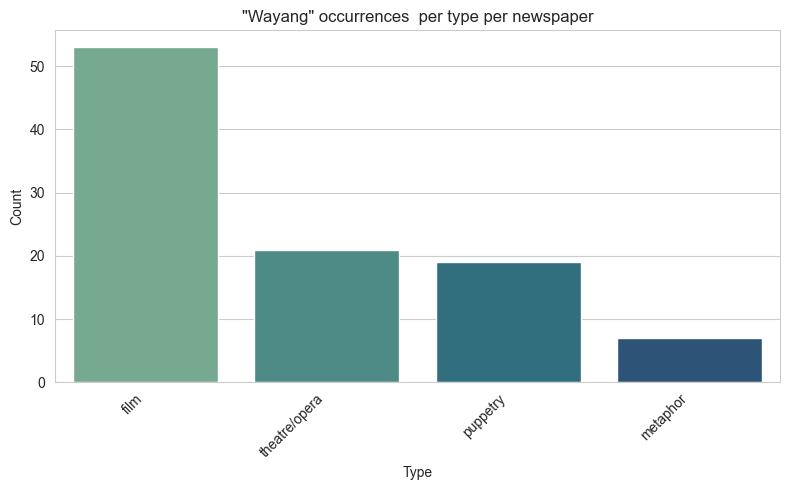
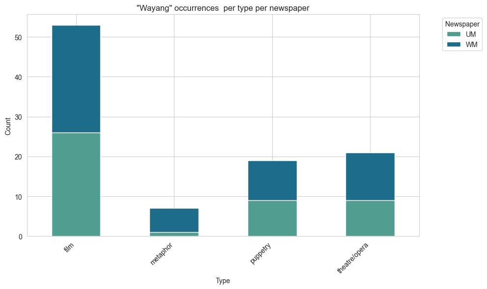

# Wayang occurrences in Singapore Malay newspapers

This dataset tracks occurrences of the word *wayang* ("وايڠ") in two Jawi-script
Malay-language newspapers published in Singapore: **Warta Malaya** (1930s) and
**Utusan Melayu** (1950s). The dasets consists of a random sample of 100 occurrences. Each occurrence was classified into three categories `film`, `theatre/opera` (including Chinese opera, bangsawan and kethoprak), `puppetry` (wayang golek or wayang kulit), or `metaphor` using a custom machine learning model developed by [The Jawi AI Project](https://culturalheritagenus.github.io/jawi/), then manually verified.

## Files

### `wayang_dataset.csv`

100 rows, one per occurrence, with the following columns:

- `date` — publication date of the issue (range: 1933-04-25 to 1956-07-24)
- `newspaper` — `WM` (Warta Malaya) or `UM` (Utusan Melayu)
- `page_number` — page number within the issue
- `page_url` — link to the scanned page image
- `full_segment` — the Jawi text surrounding the occurrence
- `type` — sense in which *wayang* is used: `film`, `theatre/opera`, `puppetry`, or `metaphor`

## Results

The following two images show the occurrences of these different senses as relative counts, and per newspaper. This preliminary data shows that film is the primary sense associated with wayang, even in the 1930s. But the most surprising finding is that wayang as metaphor became less common in the 1950s.

### `per_type.png`

Total count of occurrences by type across both newspapers.

### `per_type_newspaper.png`

Same breakdown by type, split by newspaper (WM vs UM).

## Funding

This project is supported by the [National Heritage Board](https://www.nhb.gov.sg/)(Singapore), through grant HRG-068 – Intangible Cultural Heritage in Malay-language Periodicals (1930-1970).  __Any opinions, findings, and conclusions or recommendations expressed in this material are those of the author(s) and do not necessarily reflect the views of the National Heritage Board, Singapore.__